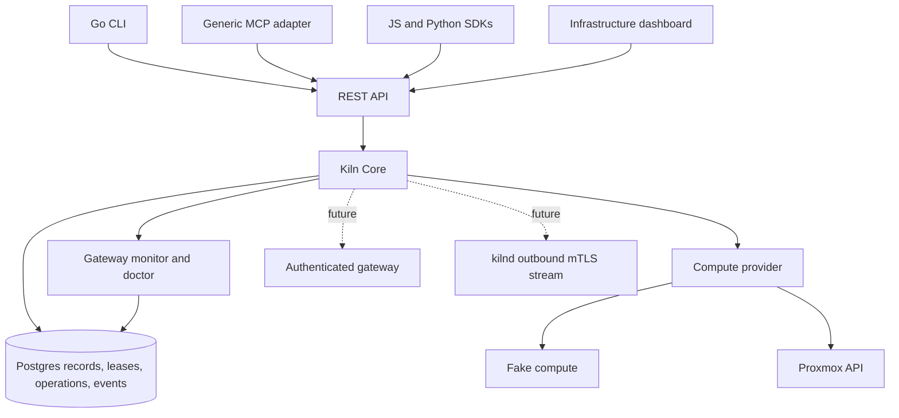

# Kiln architecture

Kiln is self-hosted infrastructure for software-engineering agents. Agents own code and tasks. Kiln owns compute. Project identity: **kiln.dev**.

This design covers the complete product direction. The implementation in this repository is the Phase 1 foundation. A feature described as future work is not an available API capability. Start with [implementation status](../implementation-status.md), [Phase 1 contract](phase-1-contract.md), and [Proxmox evidence](proxmox-evidence.md). The next live provider gate is [Proxmox lifecycle qualification](proxmox-lifecycle-qualification.md).

## Problem and success criteria

An agent needs temporary development, execution, and browser resources without knowing hypervisor credentials or running heavy work on its coordinator. The first requirement is a narrower one: Kiln must distinguish infrastructure it manages from everything else, and reject operations on anything it cannot prove it owns.

Phase 1 succeeds when contributors can start a control plane without PVE, inspect fake resources through the same REST/MCP/CLI/dashboard contract, persist resources and events in Postgres, exercise TTL expiry through the ownership guard, and run automated external-resource safety tests. It also includes protected fake gateway records, persisted gateway observations/incidents and a read-only doctor report. A configured Proxmox discovery token permits read-only inventory. Live provisioning, importing resources, repairing gateways and deleting VMs are deliberately unavailable in this phase.

Real Proxmox correctness is not established by fake-provider tests. A dedicated disposable PVE environment is required before enabling mutations. The original Phase 1 application build used no live credentials or environment. Later operator-created nested PVE fixtures passed the controlled [network experiment](nested-lab-evidence.md). They remain EXTERNAL to Core and do not prove live Core provisioning or production networking readiness.

## Options and recommendation

| Approach                                                             | Cost and risk                                                                                 | Consequence                                                                                      |
| -------------------------------------------------------------------- | --------------------------------------------------------------------------------------------- | ------------------------------------------------------------------------------------------------ |
| One logical TypeScript Core with Postgres and provider interfaces | Replicated deployment adds database failover and coordinator fencing; long jobs must be detached and journaled | Accepted application boundary; deployment depends on the qualified host topology |
| Independent scheduler, lifecycle, event, and workflow services       | Distributed consistency, message delivery and operational burden before the product is proven | Revisit when measured load or organizational ownership requires it                               |
| Thin API directly forwarding PVE commands                            | Quick prototype, but ownership and retry decisions leak into clients                          | Rejected because it cannot meet the stated safety contract                                       |

One- and two-node installations use one control appliance without requiring HA infrastructure. Qualified clusters with at least three physical hosts use three replicated control appliances on distinct hosts, with one authoritative database writer and fenced infrastructure coordinator. Ceph is not required for either mode. The accepted [control-plane HA design](control-plane-ha.md) defines the topology and its unimplemented release gates; the current scaffold still runs one API writer.

Docker Compose runs appliance services. Automatic networking additionally uses a small node egress appliance on each prepared compute node; these VMs hold no control-plane credentials. Temporary probes test workload network paths. MCP stdio clients can run locally and call the API. Later remote MCP must use the same scoped identity checks. Neither the CLI nor the dashboard has a private orchestration path.

## Component responsibilities

- Core owns authentication context, capability requests, scheduling, resource transitions, ownership checks, leases, and operations. HTTP translates requests and responses.
- Database owns durable installation identity, provenance, operations, leases, events and future workflow state. No DB credential enters a workload.
- ComputeProvider isolates discovery and lifecycle semantics. ProxmoxProvider owns API encoding and interpretation. FakeComputeProvider makes the safety boundary testable without a hypervisor.
- BrowserProvider later owns session operations. Core deals in sessions, control state, artifacts and leases rather than Playwright ports.
- The Core gateway monitor persists protected gateway health, incidents and recovery guidance, and fails closed for new fake work when configured gateways lack fresh ready evidence. [Doctor operations](../operations/doctor.md) records its available API and adapter behavior. The Core access gateway later owns authenticated preview/browser/desktop/artifact routing, lease checks, access logs and revocation. It never routes arbitrary user-supplied hostnames or ports. [Workload networking](networking.md) defines the separate private-network and node egress appliance design. [Gateway operations and recovery](gateway-operations.md) defines the later enrollment, alert and repair design.
- Workload daemon receives narrowly authorized work and reports observable activity. Workloads never receive PVE or database credentials.
- [Diagnostic network probes](network-probes.md) use fixed profiles, scoped report tokens and the one-shot Go checker. Current probe placement is unverified; reports cannot qualify workload admission.
- Workflow runtime persists stages and delegates heavy operations through REST. Agent drivers translate an individual agent CLI's observable events.

The eventual directory layout follows these responsibilities. Empty future capabilities are documented contracts, not placeholder services that pretend to execute work.

## Identity and trust

See [ownership and safety](ownership.md) and [open decisions](decisions.md). Installation identity is a random UUID generated once in a transactional database initializer. It survives normal application restarts and upgrades. An explicitly supplied installation ID must match the database or startup fails. Fake ephemeral mode has an explicitly ephemeral identity.

The pool name is `kiln`. Multiple installations sharing a cluster require distinct installation UUIDs and separate administrative policy. The pool does not isolate installations by itself. Never infer installation identity from hostname, MAC, a VM name or credentials. A restored database can hold stale ownership records. Restore starts quarantined in the deployment design; a second active appliance must not be started from the same database backup. Phase 1 has no restore/apply endpoint.

## Failure and concurrency model

The [image and attachment provenance design](image-provenance.md) extends ownership to managed templates, clone lineage and the objects attached to each VM.

The [durable provider operation journal](provider-operations.md) defines the dispatch fence, immutable request binding, task observation and unresolved-outcome policy. Persist intent before provider side effects. A timeout does not prove that creation failed. Never allocate another VM because an HTTP response was lost; automatic resubmission and clearance of unknown outcomes are unavailable.

Serialize conflicting resource changes in Postgres when multiple workers are introduced. Hold a resource lock through authoritative ownership validation and operation dispatch. This prevents Kiln workers racing each other; it does not lock out a PVE administrator. Do not advertise an atomic cross-system transaction. State and audit events commit together. Leases must not be extended concurrently with a committed destructive operation.

Discovery failure does not mean a VM disappeared. Only a confirmed absence from authoritative inspection can mark LOST. Unknown tagged resources stay external with an ORPHANED diagnostic. Drift emits an event and denies further mutation. Reconciliation never automatically adopts, deletes, repairs metadata or recreates a missing resource.

## Rollout and recovery

Phase 1 ships fake lifecycle and live read-only discovery. Phase 2 adds an appliance build and capability-checked bootstrap after networking and authentication decisions are settled. Phase 3 enables a development VM only after clone, task polling, artifact transfer, gateway authorization and destruction are tested in a disposable PVE lab.

Schema changes use ordered migrations, applied once with an exclusive migration lock before serving traffic. Back up the database before an upgrade. Downgrading an application against an incompatible schema is forbidden; restore the matched database and configuration in quarantine. Routine software updates happen within the appliance, not by reinstalling the hypervisor.

For replicated HA, the [cluster-wide upgrade procedure](deployment.md#upgrade-design) also controls member compatibility, request serving and coordinator promotion. Old replicas must not serve or take leadership against an incompatible schema. Such migrations require an explicit maintenance window and a cluster recovery boundary for rollback.

## Risks and early probes

| Risk                                                      | Required early probe                                                                                                                                 |
| --------------------------------------------------------- | ---------------------------------------------------------------------------------------------------------------------------------------------------- |
| Tags/pools treated as immutable identity                  | Tests for missing, duplicated, conflicting and reused metadata; administrator-race threat review                                                     |
| Deleting VM also deletes externally attached disks        | Disposable VM with separately tracked attached disks; deny deletion when any attachment provenance is unknown                                        |
| Permission-filtered inventory mistaken for full inventory | Lab token with incomplete VM.Audit; display visibility limits and refuse capacity guarantees                                                         |
| Local image or storage scheduled on wrong node            | Contract tests for node-local images, storage and missing network capabilities                                                                       |
| Crash after clone accepted                                | Drop provider response, restart Core, recover same task without duplicate VM                                                                         |
| Private-network design mistaken for isolation             | Disposable-lab proof of lease segments, anti-spoofing, protected-destination denial, IPv6/link-local denial, and no LAN fallback before provisioning |
| Restored DB authorizes stale/reused VM IDs                | Restore to quarantine and compare resource provenance against live inventory                                                                         |
| Preview exposes arbitrary LAN services                    | Gateway target registry, expiry, project authorization and SSRF tests before enabling previews                                                       |

All deployment-dependent decisions are tracked in [decisions.md](decisions.md). They do not block fake-provider work or read-only discovery.
