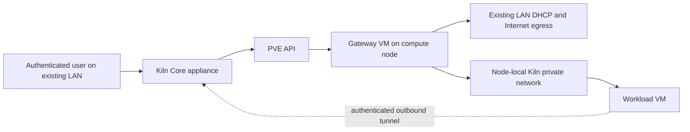

# Workload networking

## Problem

Kiln must start a development workload on a one-node PVE installation behind an ordinary home router. The operator may not control the router, switch, VLANs, DNS, or routes. Workloads still need private addressing, outbound package and Git access, and safe preview access.

The product has two network modes:

- **Automatic private network** is the default. Kiln creates its own private workload network without router, switch, VLAN, static-route, UPnP, port-forward, or public-Internet setup.
- **Existing network** is advanced mode. The operator selects an existing network and subnet. Kiln validates the selection and never treats it as isolated merely because it exists.

These are product requirements. The PVE mechanism below is a proposed implementation. It needs a disposable-lab proof before Kiln enables automatic mode for user workloads. The lab may create isolated, journaled canary resources for those tests.

## Options

| Option                                                  | Cost                                                                  | Reason for decision                                                                                                                         |
| ------------------------------------------------------- | --------------------------------------------------------------------- | ------------------------------------------------------------------------------------------------------------------------------------------- |
| Existing operator VLAN or isolated subnet only          | Requires network knowledge and hardware the basic setup does not have | Keep for advanced mode, reject as the default                                                                                               |
| Core-managed DHCP with host NAT or native SDN DHCP/SNAT | Adds services and forwarding policy to PVE hosts                      | Reject for the default. The appliance must not add host packages, enable host NAT/firewall globally, or make a PVE host the workload router |
| Per-node gateway VM with a node-local private network   | Adds a small VM, an image, memory, and a boot dependency              | Recommended. It keeps DHCP, DNS, NAT, and firewall policy outside PVE hosts                                                                 |

The gateway VM target is about 1 vCPU and 256 to 512 MiB RAM. That is a planning budget, not a benchmark.

## Recommended automatic mode

The default installation has one Core appliance on the existing LAN. It receives its management address from the ordinary LAN DHCP service. It does not configure the router or require PVE credentials inside a gateway VM.

Bootstrap prepares the selected compute nodes with a trusted node egress appliance on each node. Later administrator expansion can prepare additional discovered nodes. Ordinary workload requests use only prepared, healthy nodes. The appliance is a small gateway VM with a Kiln-owned immutable image and standard Linux network tools. It has no generic router UI and no PVE or database credential. The appliance has two sides:

- Its uplink attaches to the existing LAN and uses ordinary DHCP and HTTPS egress.
- Its downlink attaches only to a Kiln-owned node-local private VNet or bridge. The PVE host has no IP address and no physical uplink on that downlink.

The persistent gateway uses `onboot=1` after its guarded setup. Node-local automatic-mode workloads use `onboot=0` and have no HA membership. Core resumes an unexpired workload only after gateway attestation and network readiness. PVE boot order cannot prove that readiness.

The node egress appliance runs DHCP, DNS, NAT, firewall policy, and persistent workload address reservations. Workloads attach only to the private downlink. They never attach directly to the existing LAN. The appliance has no LAN administration listener. It fetches its Core configuration over an authenticated outbound mTLS session.

The proposed internal network is a VLAN-aware, node-local Simple VNet with one internal VLAN per lease. The VNet has no physical uplink. Each workload NIC uses its lease VLAN as an access tag. Only the node egress appliance receives the managed trunk. A workload never receives a trunk. Peers on the same VLAN can bypass the router, so different leases cannot share a VLAN.

The exact PVE 9.2.2 construction has controlled nested-lab evidence in [Nested network experiment](nested-lab-evidence.md). That environment remains `LAB_PROBE_ONLY`. It does not qualify automatic mode for a production node or any cluster. Automatic mode still requires the product's node qualification, ownership, health, and readiness checks before it can mark a network READY.

The lab does not meet the strict no-host-address target. PVE created an IPv6 link-local address on host self VLAN 1 for the Simple VNet. Tested workload VLANs 210 and 211 remain separate from that host VLAN. A production design must either remove the host layer-three address or membership through an explicit approved setup, or qualify and document this host-VLAN separation as the boundary. The accepted node-qualification approach below covers the API visibility required for that choice.

Before Core exists, bootstrap reserves a unique, non-overlapping IPv4 address pool for every planned node-local network in its durable installation journal. First-boot enrollment imports those reservations into Core. Core then allocates a distinct subnet and gateway address within the imported pool for each lease segment. Later administrator expansion reserves node pools through the same Core allocator before applying its plan, so it cannot race an independent bootstrap allocator.

Allocation considers known LAN routes, VPNs, storage networks, and prior reservations. It cannot discover every address range on a network safely. An unknown address view requires operator clarification. Advanced mode may supply an override only after validation. VLAN IDs and lease subnets are finite resources. Core reserves them, journals their owner and policy generation, and releases quarantine only after old attachments, reservations, policy and connection state are confirmed removed.

Automatic mode starts as IPv4-only. It must block or reject IPv6 forwarding, router advertisements, and link-local bypasses until the equivalent IPv6 design is tested. IPv4 NAT does not make an IPv6 path safe.

## Existing network mode

Existing network mode is an advanced profile. The operator selects the existing bridge or VNet, an optional VLAN, CIDR, DHCP or static-address source, gateway, DNS, egress, and access options. Kiln shows those external references in the plan and does not change them.

The profile must pass the same isolation, protected-destination, ownership, and fail-closed rules as automatic mode. A selected bridge, VLAN, or subnet is not proof. If the profile cannot prove those rules, Core leaves it NOT_READY and refuses provisioning.

This diagram describes the recommended target. It does not claim that the current provider creates any of these objects.

## Access model

The local user reaches the authenticated Core LAN address. The CLI may discover that address and report status after enrollment. TLS, enrollment, address renewal, and discovery still need a lab and product design.

The normal local deployment assumes the administrator and orchestration client are on the same LAN as Core. A remote or cloud-hosted client needs an existing VPN or an optional Tailscale private-access setup. Kiln does not open a router port or create public access automatically.

Preview traffic uses a Core gateway and authenticated outbound workload tunnels. Core permits a tunnel only to a registered workload service for the caller's project and active lease. It never acts as an arbitrary LAN proxy. Browser, desktop, and artifact routes follow the same target registry and authorization rule.

## Isolation boundary

NAT is address translation, not a security boundary. Guests on the same L2 network can bypass a router and reach each other directly. The default must not use a shared flat bridge as proof of isolation.

Release qualification proves the PVE construction with canary resources before Kiln offers a mode. At runtime, before Core marks a network READY, it checks the configured policy, current inventory, gateway health and capacity, reservation state, and the known isolation evidence for every lease. The release suite must prove one of these boundaries for every lease:

1. A distinct validated internal virtual segment for the lease, with only the gateway allowed to route between segments.
2. A proven equivalent isolation mechanism that blocks L2 peer reachability and source-address spoofing.

The proof must also show that workloads cannot use host link-local paths, IPv6 paths, or an extra NIC to escape the policy. A failed probe, incomplete PVE inventory, missing gateway capacity, or a gateway that does not pass health checks leaves the network NOT_READY. Provisioning holds. Kiln never falls back to the LAN.

Gateway policy denies protected destinations before NAT: the existing LAN, private and link-local ranges, cloud metadata endpoints, PVE and cluster services, storage networks, and specifically identified protected local prefixes even when they use public addresses. A discovered default route is not a denied destination set; ordinary public package and Git destinations remain eligible for the configured egress policy. Narrow DNS and Core exceptions are explicit and logged. The policy must not grant unrestricted control-plane, PVE, or guest access.

Gateway restart fails closed. Existing workload leases keep their deny policy when Core is down. Reservations and policy generations persist in the appliance state. A Core outage must not widen gateway routing or expose a workload on the LAN. Appliance upgrades drain the node and hold new provisioning until the replacement passes readiness checks. Gateway monitoring, incident states, protected-infrastructure rules, and the proposed doctor recovery path are in [gateway operations](gateway-operations.md).

## Cluster behavior

Each node has an independent private network and gateway. A multi-node bootstrap connects to one existing PVE cluster endpoint and requires quorum, adequate membership visibility, and qualified online selected nodes. An unselected member may be offline. A selected offline node is ineligible and shown to the administrator. Kiln never creates or joins a cluster, forces quorum, edits Corosync, or changes expected votes. A standalone host becoming a cluster is an administrator project outside Kiln and requires provider-binding revalidation before future writes.

The scheduler includes network readiness and gateway capacity alongside compute and storage capacity. It does not promise cross-node L2 connectivity through a Simple VNet.

Automatic mode does not migrate or make highly available a workload that depends on a node-local gateway and network. An advanced shared-network profile, or an explicit reprovision workflow, is required for that move. Control appliance HA is a separate decision and still requires writer fencing.

## PVE and SDN boundary

The design does not set the PVE SDN subnet gateway or SNAT fields for the dedicated-gateway default. Those fields can place an address on the PVE host VNet or use node forwarding, which conflicts with this design. Kiln also avoids PVE's optional SDN DHCP because it runs `dnsmasq` on the physical node.

PVE documents [Simple zones](https://pve.proxmox.com/pve-docs/chapter-pvesdn.html#pvesdn_zone_plugin_simple) as node-local and supports [VNet VLAN settings](https://pve.proxmox.com/pve-docs/chapter-pvesdn.html#pvesdn_config_vnet) and [guest VLAN tags](https://pve.proxmox.com/pve-docs/chapter-pve-network.html#_vlan_for_guest_networks). Its port-isolation behavior applies to all guest ports and does not demonstrate a workable router-VM exception. A host without an address on the downlink is required but does not prove isolation. The lab must settle the exact compatible construction. These sources are evidence, not a support claim.

Bootstrap may use elevated, scoped native SDN permissions only to create the reviewed plan. The relevant PVE permissions include `SDN.Audit`, `SDN.Allocate`, and `SDN.Use`, but the lab must validate the exact ACLs for the pinned release. The normal runtime token has no SDN administration. Adding an automatic network to another node is an explicitly authorized bootstrap or administrator expansion. An ordinary workload request cannot trigger it. The gateway VM has no PVE credential.

Applying SDN changes can activate pending changes made by other administrators. Before apply, bootstrap checks the pinned PVE version and pending configuration, serializes the operation, and refuses unrelated pending changes. A Kiln operation lock does not fence PVE administrators. Safe activation scope and concurrent-edit handling require lab proof; a race or unrecognized pending change is a stop condition.

### Accepted node qualification

PVE 9.2.2's structured network API does not report runtime bridge-self VLAN membership. `GET /nodes/{node}/report` with `Sys.Audit` reports addresses and promiscuity in broad, unstructured output, but it still does not report bridge-self VLAN membership. The installed-source audit covered `PVE/API2/Nodes.pm` lines 1925-1946, `PVE/Report.pm` lines 78-88, and `PVE/API2/Network/SDN/Nodes/Zone.pm` lines 236-299.

Automatic mode requires temporary, host-key-verified, read-only SSH qualification on every selected online node. It runs at installation, when an administrator prepares another node, after a relevant PVE upgrade, or after a declared host-network change. It installs nothing and retains no SSH credential. It does not run whenever Kiln creates a workload VM. API-only `USER_ATTESTED` is not approved for automatic mode.

These checks qualify a point in time. They do not provide continuous assurance. Runtime admission still relies on current inventory, policy, gateway health, and the other READY checks in this document.

## Ownership and rollback

The zone, VNet, gateway VM, subnet allocation, and policy are journaled Kiln resources with API-specific provenance. Do not assume a PVE object type supports VM tags. The existing uplink bridge and VLAN references are EXTERNAL and immutable.

## Network records

These are future Core records. They describe the data that bootstrap and the scheduler must preserve. They do not add a Phase 1 schema or API.

| Record                | Required facts                                                                      | Ownership rule                                                                                           |
| --------------------- | ----------------------------------------------------------------------------------- | -------------------------------------------------------------------------------------------------------- |
| Network profile       | Mode, requested egress and access policy, selected node, status                     | Kiln-managed profile. Existing bridge, VNet, VLAN, CIDR, gateway, DNS, and DHCP references stay external |
| Node network          | Allocated CIDR, zone or bridge construction, capacity, health evidence              | Kiln-managed and journaled with API-specific provider identity                                           |
| Node egress appliance | Image digest, VM provenance, uplink reference, policy generation, reservation store | Kiln-managed VM. It receives no PVE or database credential                                               |
| Lease segment         | Lease ID, internal VLAN ID, CIDR or address, anti-spoofing rule                     | Kiln-managed. An ID remains quarantined after release before reuse                                       |
| Published service     | Lease, port, protocol, project, expiry                                              | Kiln-managed registry entry. It is the only preview target Core may route                                |

Network status has at least DRAFT, APPLYING, READY, NOT_READY, and QUARANTINED outcomes. Only READY may accept a workload. A provider timeout remains APPLYING or QUARANTINED after inspection. It never becomes READY because a create request was sent.

Bootstrap records the dependency graph before the first create call. Rollback considers only its exact journaled resources and owned dependencies. It refuses deletion when a resource has an unknown attached guest or a dependency that no longer matches its recorded provenance.

Deleting a gateway or network without first stopping and inspecting attached workloads is forbidden. A failed or unknown PVE task stays pending investigation. It does not trigger a second network allocation or a broad cleanup.

## Failure handling

| Condition                                                                    | Required result                                                                                 |
| ---------------------------------------------------------------------------- | ----------------------------------------------------------------------------------------------- |
| Gateway health, capacity, reservation state, or policy generation is missing | Mark the node network NOT_READY and hold new provisioning                                       |
| Core is unavailable                                                          | Keep the appliance deny policy and existing reservations. Do not open a LAN path                |
| An administrator has unrelated pending SDN changes                           | Refuse apply and preserve the plan for review                                                   |
| Provider response is lost                                                    | Inspect the recorded object and task before retrying. Do not allocate another CIDR, VLAN, or VM |
| An owned network has an unknown attached guest                               | Quarantine it and refuse rollback deletion                                                      |
| A workload has an unexpected NIC or route                                    | Quarantine the lease and deny further network access until investigation                        |

## Bootstrap and readiness

The future bootstrap plan for automatic mode must show the selected compute node, proposed CIDR, gateway image and resources, private-network construction, ownership records, expected policy, and the required PVE permissions. It must show external bridge and VLAN references as read-only context.

Release qualification uses isolated, journaled canary resources for the following probes. Runtime admission checks the deployed version, current policy and readiness evidence described above before creating user workloads:

- Verify the pinned PVE release and the exact Simple-zone or bridge construction in a disposable lab.
- Verify each lease cannot reach a peer lease at L2 or L3, including spoofed source addresses.
- Verify forged VLAN tags, double tags, VLAN IDs 0 and 4095, and reuse after quarantine all fail safely.
- Verify the workload cannot reach PVE, Core administration, cluster, storage, metadata, LAN, link-local, or IPv6 destinations except documented allow rules.
- Verify DNS behavior, outbound package and Git access, address reservation persistence, and fail-closed gateway restart.
- Verify that an authenticated registered preview works and that arbitrary LAN proxy targets fail.
- Verify SDN pending-change detection, serialization, ownership checks, and rollback after a lost provider response.

No real-network authorization follows from this document. Phase 1 remains fake lifecycle and read-only PVE discovery. The nested test VM 103 is external to Core and does not satisfy these probes.

## Open questions

1. Which PVE major and minor versions can implement the required internal segments and anti-spoofing without host routing?
2. What exact guest network image and firewall implementation meet the gateway memory target and boot reliably?
3. How do TLS, Core enrollment, LAN address discovery, and DHCP address renewal work without a router change?
4. Which known routes and interface data can Core inspect safely, and when must it ask the operator about an unknown network?
5. What advanced existing-network profiles can prove isolation, and what proof does each require?
6. How are gateway image updates, policy changes, and reservations rolled out without opening a transient path?
