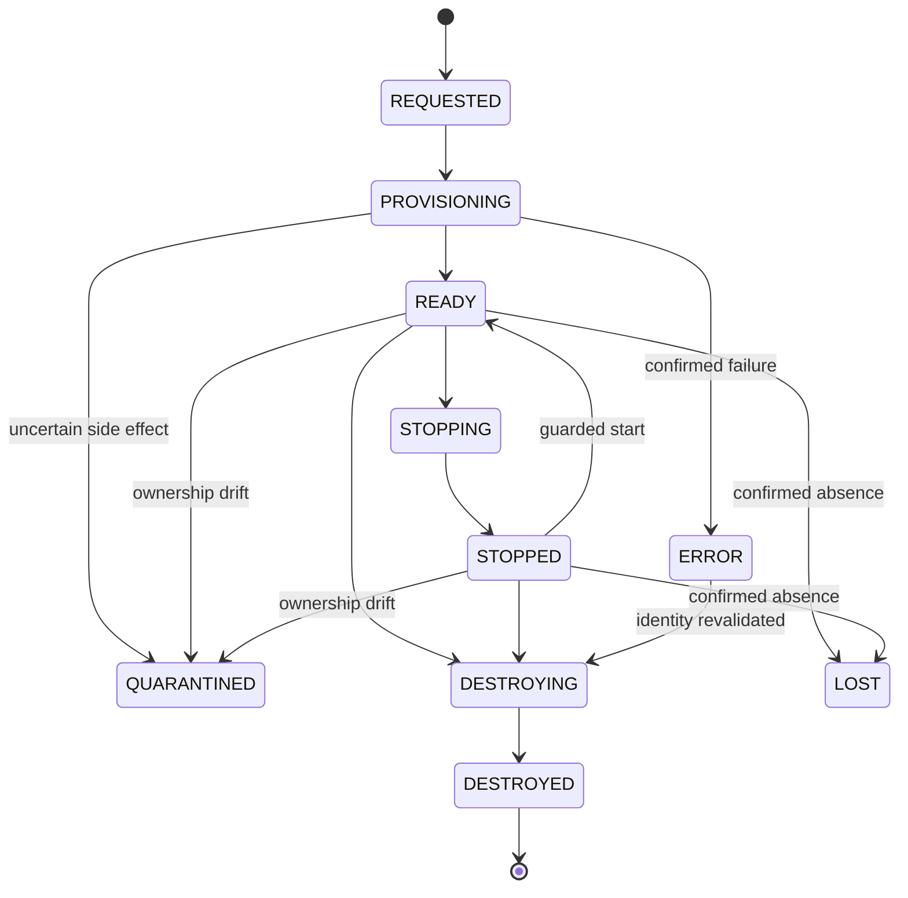

# Resource, lease and operation state machines

Ownership, lifecycle, and observed provider state are different axes. A stopped external VM remains EXTERNAL. An expired lease does not grant lifecycle authority. ORPHANED is an inventory diagnostic.

## Resource lifecycle

This is the target lifecycle. Consult executable Core code for the implemented subset. Phase 1 has no live start/provision operation. A transport timeout never justifies a transition to LOST or DESTROYED. An operation whose result is unknown requires inspection of its recorded provider task before recovery. QUARANTINED does not automatically return to READY.

A repeated destroy of an already DESTROYED resource returns the recorded result without touching its old provider ID. If that ID was reused for an external VM, the external VM is unaffected. Terminal operation replay is different from sending another delete.

## Lease

A lease has a resource ID, installation/project ownership, created time, expiration, creator, extension policy and release state. Temporary resources require a finite TTL. Use server UTC for comparisons and a controllable clock in tests. Phase 1 accepts bounded TTL seconds; CLI adapters convert duration syntax before making the same request.

Target states are ACTIVE, EXPIRING, RELEASED, BLOCKED and EXPIRED. EXPIRING locks the operation against extension. An expiry worker selects only persisted owned records whose expiration is at or before now. It calls Core destruction with a system identity constrained to that resource's project. Guard denial records BLOCKED/safety event and continues processing other leases. Failed cleanup remains observable and retryable without widening ownership authority.

An extension adds its requested duration to the later of current expiration and now, subject to the configured maximum remaining lifetime. It is rejected if destruction has begun or the resource is terminal. Later semi-persistent profiles need explicit administrator policy, quotas and renewals, not a magical infinite TTL.

## Operation journal

Operation states are PENDING, RUNNING, SUCCEEDED, FAILED and UNKNOWN in the target model. Phase 1 implements INTENT, COMPLETED and UNKNOWN. Resource transitions carry more detailed lifecycle state. Persist a normalized request hash with the idempotency key and authenticated project scope. Matching retries return the same resource/operation; conflicting requests return 409. A key is not authorization and must never permit reading another project's result.

Allocate and persist the Kiln resource ID before invoking a provider create. Do not infer a missing response means no side effect. Each future PVE operation persists its UPID and polls its task to completion. Guest readiness is separate from task completion and boot power state.

## Future browser and workflow state

Browser lifecycle uses the same resource/lease base. Browser control state is independent: AGENT_CONTROL, HUMAN_CONTROL or PAUSED. WAITING_FOR_HUMAN is task status, allowing authenticated handoff without destroying the browser. A control-generation number rejects queued stale agent actions after takeover.

Workflow lifecycle: REQUESTED -> RUNNING -> COMPLETED or FAILED or CANCELLED, with WAITING_FOR_APPROVAL/NEEDS_HUMAN pauses. Stage attempts have separate IDs and results. Retrying Builder does not rerun completed Scout and Plan. Dependencies pin specific prior attempt artifacts. Cancellation cascades only to resources created for that workflow according to their lease policy; it never sweeps a pool.
